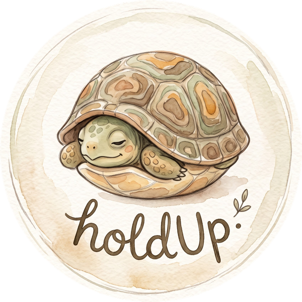

<p align="center">
  
</p>

<h1 align="center">HoldUp</h1>

<p align="center">
  <b>Pause before you scroll. Mindful friction for healthier digital habits.</b>
</p>

<p align="center">
  <a href="https://github.com/SneakyZippy/HoldUp/releases"></a>
  <a href="LICENSE"></a>
  
</p>

---

HoldUp intercepts doomscroll apps (Instagram, TikTok, YouTube, Reddit, etc.) with a mindful pause instead of a frustrating hard block. Break autopilot muscle memory and regain conscious control of your screen time.

## How it works

When you open a monitored app, HoldUp pauses you with a mindful intervention:

- **Mindful Reflections**: Curated grounding prompts and reality checks (with hide/downvote and custom quotes).
- **Breathing Exercise**: Rhythmic breath cycle with gentle haptics.
- **Personal Anchor**: Photo of a loved one or video message from a friend.
- **Healthy Swaps**: Quick ideas of rewarding things to do instead.

Choose to **Walk Away** (+10 pts) to log a mindful win and return home, choose a **Healthy Swap** (+20 pts) to redirect your energy, or open the app mindfully for a set session (**5, 10, or 15 min**). When your time expires, a soft nudge brings you back to reality.

## Mindful Points & Levels

Every time you decide not to open a shielded app, you earn **Mindful Points**:
- **Walk Away**: +10 points
- **Healthy Swap**: +20 points
- Level up through focus tiers (*Mindful Novice* → *Focus Builder* → *Focus Pro* → *Habit Champion* → *Zen Master*) and track your progress right from the dashboard.

## Download & Build

Download the latest APK directly from [Releases](https://github.com/SneakyZippy/HoldUp/releases).

Build locally:
```bash
./gradlew assembleDebug
```

## Permissions
- **Accessibility Service**: Detects app launches and handles navigation when you walk away.
- **Usage Access**: Displays today's screen time in the reality check banner.

## Privacy First
HoldUp processes **all data 100% locally on your device**. No accounts, no tracking, no analytics, and no external network calls.

## Contributing
Contributions, feature suggestions, and pull requests are welcome! If you find a bug or have an idea, feel free to open an issue or submit a PR.

## License
This project is open-source under the [GNU General Public License v3.0](LICENSE). You are free to inspect, modify, and contribute to the code. Any derivative work or distribution must remain open source under the same license with attribution.
